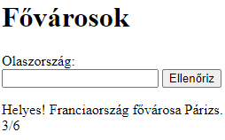

# Fővárosok

Készíts webalkalmazást, amely néhány európai ország fővárosait kérdezi ki!

Induláskor jelenjen meg az első kérdés!

Az alkalmazás a következő országok és fővárosok közül válasszon véletlenszerűen:

* Magyarország: Budapest,
* Németország: Berlin,
* Ausztria: Bécs,
* Csehország: Prága,
* Spanyolország: Madrid,
* Olaszország: Róma,
* Svédország: Stockholm,
* Finnország: Helsinki,
* Franciaország: Párizs,
* Egyesült Királyság: London

Amikor a felhasználó beírta a fővárost, és megnyomja az <kbd>Enter</kbd> billentyűt vagy rákattint az Ellenőriz gombra, akkor:

* Ellenőrizze, hogy jó-e a válasz! Ne tegyen különbséget kis- és nagybetűk között! Üres választ ne fogadjon el!
* Ha jó a válasz, akkor azt írja, hogy "Helyes!", ha nem jó, akkor azt, hogy "Nem jó!", majd írja mellé a helyes választ úgy, ahogy a mintán látható!
* A helyes válasz alatt jelenjen a jó válaszok / az összes kérdés száma!
* Az ellenőrzés után a szövegmezőből tűnjön el a válasz, és fölötte jelenjen meg a következő véletlenszerűen választott ország neve!

Formázd meg az oldalt ízlés szerint!
